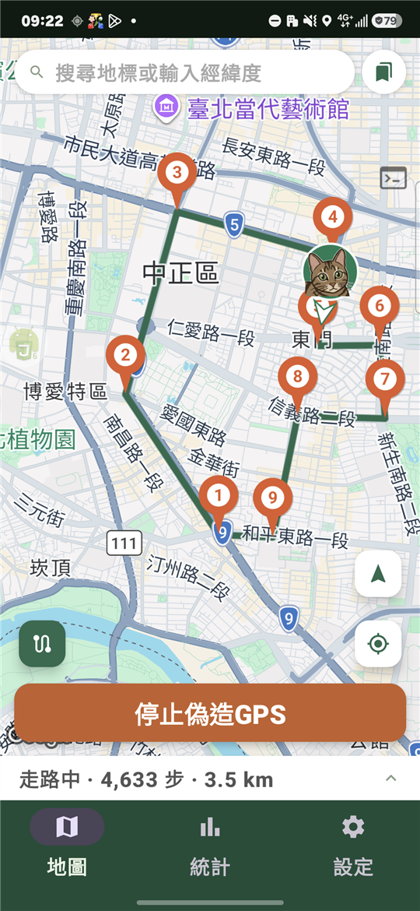
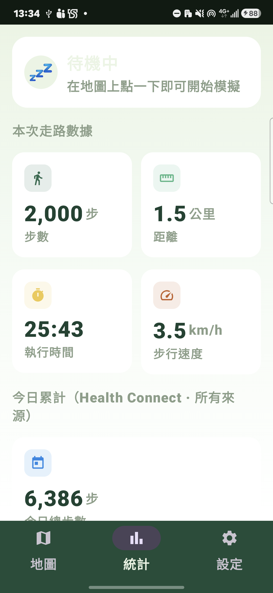
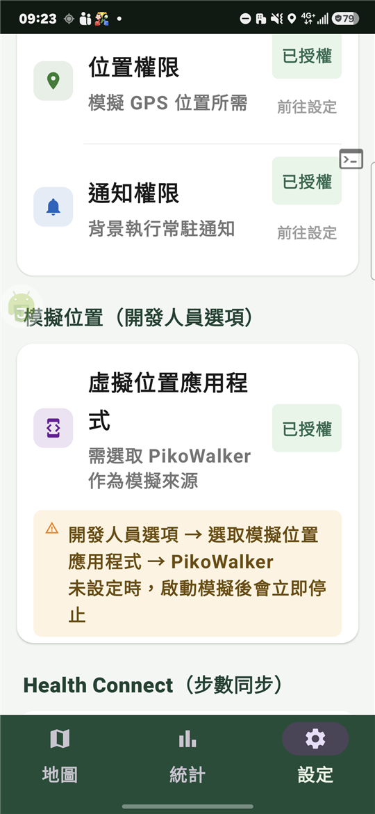

  

<h1 align="center">PikoWalker</h1>

  在手機上模擬走路，讓皮克敏等步行遊戲以為你真的在移動。

---

## 這是什麼

PikoWalker 會假造手機的 GPS 位置，讓你可以在地圖上規劃一條路線，它就會照著這條路線慢慢「走」，遊戲那邊會跟著收到位置在移動、步數在累積。

## 截圖

| 地圖 | 統計 | 設定 |
|---|---|---|
|  |  |  |

## 開始使用前：一次性設定

打開 PikoWalker 後，先到「**設定**」頁把下面幾項都弄好，之後就不用再管了：

1. **基本權限**

   位置權限、通知權限，第一次打開 PikoWalker 就會跳出來要求，全部允許。

2. **模擬位置（開發人員選項）**

   這是最容易漏掉、也最容易讓功能失效的一步：
   - 手機「設定」→「關於手機」連點版本號 7 次，打開「開發人員選項」
   - 開發人員選項裡找到「**選取模擬位置應用程式**」，選 **PikoWalker**
   - 沒設定這項的話，按下「開始偽造GPS」會馬上又自動停止

3. **電池最佳化**

   設定頁會顯示目前狀態，沒關閉的話會有紅色「去停用」按鈕，點下去照著系統畫面把 PikoWalker 排除在電池最佳化之外。沒做這步，走一走定位常常會自己飄回真實位置。

4. **Health Connect → 皮克敏（如果想同步步數）**

   **如果只想在地圖上看角色移動、不在乎遊戲裡的步數會不會變，這一步可以整個跳過。**

   皮克敏現在可以**直接讀 Health Connect 的步數**，不用再像以前一樣多繞一層 Google Fit，只要兩段授權：

   **1. 確認手機上有 Health Connect**
   - Android 14（含）以後的手機，Health Connect 已經內建在系統裡，不用另外裝，直接看下一步。
   - Android 13 或更舊的版本，要先到 Google Play 商店搜尋「Health Connect」安裝它（開發者是 Google LLC）。
   - 不確定自己手機是哪個版本也沒關係，先跳到下一步操作；如果系統真的沒有 Health Connect，PikoWalker 設定頁會顯示無法使用，那時候再回來裝就好。

   **2. 讓 PikoWalker 可以把步數「寫進」Health Connect**

   打開 PikoWalker →「**設定**」頁 →「Health Connect（步數同步）」區塊 → 按「**授予權限**」，手機會跳出 Health Connect 的授權畫面，把「寫入步數」打勾允許。做完後，PikoWalker 設定頁上「步數讀寫權限」會變成綠色「已授權」。

   **3. 讓皮克敏改成看 Health Connect 的步數**

   打開**皮克敏**遊戲本身 →「設定」→「隱私權 & 步數」→「步數」，會看到步數測量方式的選項，切成「**使用 Health Connect 追蹤步數**」，遊戲就會改去讀 Health Connect 裡的數字。

   三步做完，資料流是：PikoWalker 走路產生步數 → 寫進 Health Connect → 皮克敏直接讀 Health Connect 的數字、更新遊戲內步數。

   **皮克敏設定裡沒有「使用 Health Connect 追蹤步數」這個選項？**

   代表你的皮克敏版本還沒支援直接讀 Health Connect，需要多繞一層 **Google Fit** 當中繼站，資料流變成：PikoWalker 寫進 Health Connect → Google Fit 讀到、更新每日步數 → 皮克敏讀 Google Fit 的數字。除了上面兩步，多做這兩件事：

   - 打開手機系統的「**設定**」（不是 PikoWalker 裡面的設定），在最上面的搜尋欄輸入「**Health Connect**」點進去，找到 **Google Fit**，把它的「讀取步數」權限打開——這一步很容易漏掉，Google Fit 才會主動去 Health Connect 撈 PikoWalker 寫進去的步數。
   - 皮克敏「步數」設定切成「**使用 Google Fit 追蹤測量**」，而不是「使用 Health Connect 追蹤步數」。

   **想馬上看到步數變化的話**：如果走的是 Google Fit 這條路，它不是隨時都在背景同步，先自己打開一次 **Google Fit**（讓它主動去跟 Health Connect 要一次最新資料），再打開皮克敏通常就能馬上讀到新的步數，不用乾等。走直接讀 Health Connect 這條路則沒有這個問題。

## 怎麼用

### 走到一個定點（不移動）

在地圖上點一下想去的位置，或用上方搜尋框輸入地標名稱／經緯度，找到後按「設為模擬點」，再按下方「**開始偽造GPS**」即可。

### 規劃一條路線並自動走

1. 按地圖左下角的路徑圖示切換成「路徑模式」
2. 依序點擊地圖，建立一串路標（可以在下方清單拖曳調整順序，或刪除單一點）
3. 選擇**走路模式**：
   - **來回折返**：走到終點後原路走回起點，一直重複
   - **循環回起點**：走到終點後直接跳回起點，繞圈走
   - **到底定點**：走到終點就停在那裡
4. 選擇**速度**（慢步／正常／快步，或自訂 km/h）與**步數上限**（達到後自動停止，也可選無上限）
5. 按「開始偽造GPS」→「走這條路徑」開始走

走路過程中，速度和步數上限都可以隨時在下方面板即時調整，不用停下來重設。中途按「停止模擬走路」可以暫停，之後選「繼續走這條」接著走，或「重新走這條」從頭開始。

貓頭圖示旁邊會有一個隨移動方向轉動的小箭頭，代表目前的行進方向——只有實際在走路徑時才會顯示，單純停在一個定點時沒有方向性，箭頭會隱藏。

### 直接拖曳貓頭微調位置

貓頭圖示本身可以直接長按拖曳，放開後偽造GPS會立刻移動到放開的位置，不用先點旁邊再刪掉重點。這對「只是想挪到旁邊一點點」的情況特別好用，即使正在走一條路徑、中途暫停下來，也可以先拖曳貓頭挪個位置再繼續走。

### 儲存常用路線

在路徑模式下按「儲存」可以把目前路線存起來，之後在「已存路線」頁籤直接選用，不用每次重畫。

### 排程自動開始

「設定」→「排程自動開始」，開啟開關、選時間、選一條已存路線，時間到就會自動開始偽造GPS，重開機後排程也還在，不用再設一次。

如果排程區塊出現橘色提示：
- 「尚未取得精確鬧鐘權限」：按「前往授權」給一次權限，不然排程時間可能會有幾分鐘誤差。
- 「尚未取得背景定位權限」：按「前往授權」給一次權限。這是給排程這個功能專用的——手動在地圖頁按開始不受影響——但沒有這個權限的話，時間到時如果手機已經閒置一段時間，自動開始有機率會失敗。

三星手機額外要注意：三星自己的省電機制不吃 Android 官方的「電池最佳化」排除，就算 PikoWalker 設定頁的電池最佳化已經顯示「已停用」，三星還是可能自己把 PikoWalker 的背景執行砍掉。要完全避免，另外去手機的「**設定 → 電池與裝置維護 → 背景使用限制**」，把 PikoWalker 加進「**從不休眠的應用程式**」清單。

### 純點：用社群整理好的乾淨定位點

「純點」是社群一起整理、回報的一批座標，特色是**確定沒被其他玩家佔用過**——用來種花／種菇，不會因為附近早就被別人種過而白費。PikoWalker 內建了一份約 6,400 筆的純點資料庫（跟資料一起打包在 App 裡，離線也能查，但不會即時更新，僅供參考，實際地點是否仍然乾淨還是要靠自己判斷），底部導覽列「**純點**」分頁就能直接查。

**怎麼查**

- 上面搜尋列可以直接打名稱關鍵字搜尋
- 搜尋列右邊的篩選圖示（有套用篩選時會變綠色、右上角出現小圓點）按下去，會展開「**縣市**」「**行政區**」「**種類**」三個篩選——行政區要先選縣市才能選，範圍才不會列出全台上百個行政區；種類選單裡每個項目前面都有對應的 emoji，方便對照
- 縣市／種類選項比較多的時候，跳出的選單上方會自動出現搜尋框，直接打字篩選，不用整排慢慢捲
- 篩選完直接搜尋或點掉搜尋框，篩選面板會自動收起來，把畫面空間留給下面的純點清單；上次選的搜尋字跟篩選條件，切去別的分頁再切回來也還在，不會被清空

**按「去此點」之後會發生什麼**

- **偽造GPS還沒開啟**：跳到地圖分頁、鏡頭飛過去、出現一個藍色圖釘，按「設為模擬點」再按「開始偽造GPS」才會真的定位過去——跟分享 Google 地圖連結進來的行為一樣，不會不問一聲就動到任何東西。
- **偽造GPS已經在跑**：直接把偽造位置改到這個純點的座標、跳到地圖分頁給你看結果，不會再跳出確認——效果等同直接把貓頭圖示拖到這個座標放開。正在走一條路徑的話，先在地圖頁按「停止模擬走路」才能改變位置。

**資料來源與致謝**

PikoWalker 內建的純點資料來自兩個社群網站：

- [pikmin.talllkai.com](https://pikmin.talllkai.com)（純點地圖）
- [pikdecor.com](https://pikdecor.com)（純點地圖｜飾品純點數據中心）

這些座標都是網友一筆一筆實際跑點、回報、驗證累積出來的，PikoWalker 自己完全沒有蒐集或驗證能力，純粹是把這兩個網站已經公開的資料整理進 App 方便查詢。非常感謝這兩個網站的經營者，以及所有回報、驗證過純點的網友——沒有你們就沒有這份資料庫。

如果你是這兩個網站的經營者或資料貢獻者，不希望自己的資料被 PikoWalker 這樣使用，麻煩到 [GitHub Issues](https://github.com/catskytw/pikowalker/issues) 開一個 Issue 告知，我會立刻把對應資料下架。

### 從 Google 地圖直接帶座標過來

在 Google 地圖上找到一個點，按「分享」，選 PikoWalker，就會直接跳轉到地圖上該座標；點一般地標連結（`geo:` 連結）也可以。

商家或地點型的分享，Google 有時候沒有把座標放進連結裡。遇到這種情況，先在 Google 地圖上同一個位置**長按**一下，會跳出一個帶座標的地圖標記（跟原本的商家頁面不一樣），改用這個標記分享給 PikoWalker 通常就能帶到座標了；如果還是不行，才需要自己輸入經緯度。

## 統計頁

顯示這次走路的步數、距離、花費時間、速度，以及 Health Connect 裡「今日累計」的所有來源步數（不只 PikoWalker 貢獻的）。如果數字跟預期不一樣，可以到「設定」頁的「手動校正今日步數」直接輸入正確數字套用——但只能新增或刪除 PikoWalker 自己寫入的部分，其他應用程式貢獻的步數沒辦法刪掉。

## 常見問題

**Q：按了開始偽造GPS，馬上又跳回停止？**

A：去「設定」確認「模擬位置應用程式」是不是選了 PikoWalker（開發人員選項裡）。

---

**Q：PikoWalker 顯示還在走，但遊戲裡的角色卻飄回真實位置不動了？**

A：先確認「電池最佳化」是「已停用」狀態。如果已經是已停用還是發生，把偽造GPS完全停止、再重新開始一次通常可以恢復；如果常常發生，麻煩照下面「回報問題」的方式抓紀錄給我看。三星手機特別容易發生這個狀況，請參考上面「排程自動開始」段落最後三星專屬的設定步驟。

---

**Q：排程自動開始設定好了，但時間到卻沒有反應？**

A：先確認「設定」→「排程自動開始」裡沒有橘色提示（精確鬧鐘權限、背景定位權限都要授權）。如果都授權了還是偶爾沒反應，通常是手機自己的省電機制把 PikoWalker 背景執行砍掉了，尤其三星手機——同樣參考上面「排程自動開始」段落最後的三星專屬設定。

---

**Q：打開 PikoWalker 卡在讀取畫面，或閃退回桌面？**

A：先完全關閉 PikoWalker（從最近使用列表滑掉）再重新打開一次，通常會自動恢復。如果重開還是卡住，把手機重新開機通常能解決；常常發生的話麻煩照下面「回報問題」的方式回報。

---

**Q：Google Fit / Health Connect 步數沒有增加，或皮克敏裡步數沒變？**

A：照「開始使用前」第 4 項確認設定好了：PikoWalker 有寫入 Health Connect 的權限、皮克敏的「步數」設定切成「使用 Health Connect 追蹤步數」（皮克敏設定裡沒這個選項的話，改確認 Google Fit 那條舊路徑的兩步都做了）。缺一個步數都不會進遊戲。都設定好但還是沒看到變化，且走的是 Google Fit 那條路的話，先打開一次 Google Fit 讓它跟 Health Connect 同步，再開皮克敏。

### 回報問題

- 一般問題（例如定位飄走、步數沒同步）：「設定」→「除錯」→ 按「匯出並分享除錯紀錄」，把檔案傳給我（例如用 LINE），裡面會有定位模擬相關的事件記錄，方便排查。
- PikoWalker 當機、閃退、或打不開：先完全關閉它再重新打開一次，如果「設定」→「除錯」出現紅色的「偵測到上次的當機紀錄」，按「分享上次的當機紀錄」傳給我——這個才有真正當機當下的詳細資訊。

## 更新版本

「設定」→「版本資訊」→「檢查更新」，有新版會顯示更新內容，按「下載並安裝」開始下載；下載完成後畫面會換成「安裝新版本」按鈕，再按一次才會真的開始安裝，過程中不需要重新側載安裝檔。第一次用這個方式安裝，系統可能會跳出「允許安裝不明來源應用程式」的授權畫面，允許就好。

如果剛發布新版沒多久按「檢查更新」卻顯示「已是最新版本」，可能是 GitHub 那邊還沒同步完成，等一兩分鐘再試一次即可。

## 注意事項

PikoWalker 僅供個人測試使用，模擬定位可能違反部分服務的使用條款，請自行評估風險。
